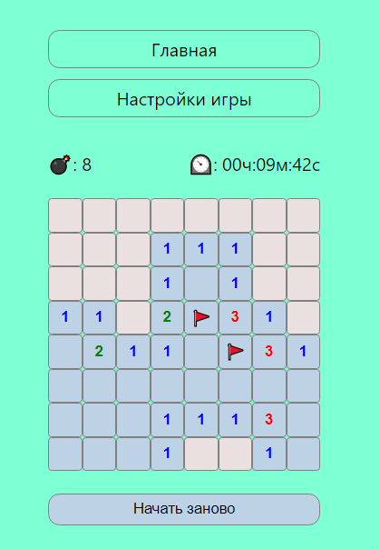

# **Minesweeper** 💣 [Play Now!](https://minesweeper-nu-ebon.vercel.app/r)

## Minesweeper clone with TypeScript, Redux, and NextJS

## Rules

---

The rules are pretty simple (try to play with the [demo](https://minesweeper-nu-ebon.vercel.app/r)):

- Player can left click to reveal square.
- Player can right click to flag square as mine.
- The number tells how many mines are in the immediate neighborhood.
- The goal is to reveal or flag all squares without revealing a mine.

## Deploy on Vercel
